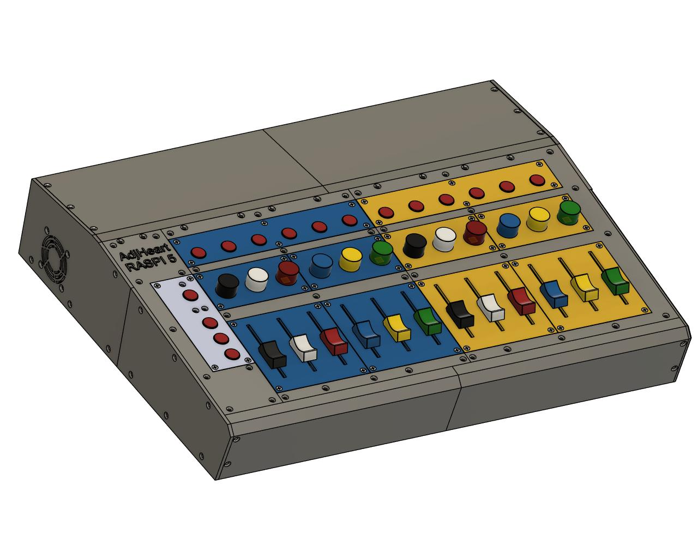

# The AdjHeart Modular Synthesizer
## General Decription
The AdjHert (AdjSynth) is a modular polyphonic MIDI musical synthesizer project.

It is designed, but not limited, to run on a Raspbey Pi 5 computer board.

The project is divided into 2 parts:
1. A c++ engine (this project) that generates, process and controls the audio output.
2. A Qt5 based application (AdjRasp5SynthApp_1) that provides the workflows and GUI.

The AdjSynth supports the JackAudio architecture that provides a low latency audio streaming.

The AdjSynth supports external MIDI keyboards based on the ALSA MIDI streaming architecture

### The AdjSynth Engine

### The AdjSynth GUI

### The AdjSynth Control Box

## Detailed Decription

