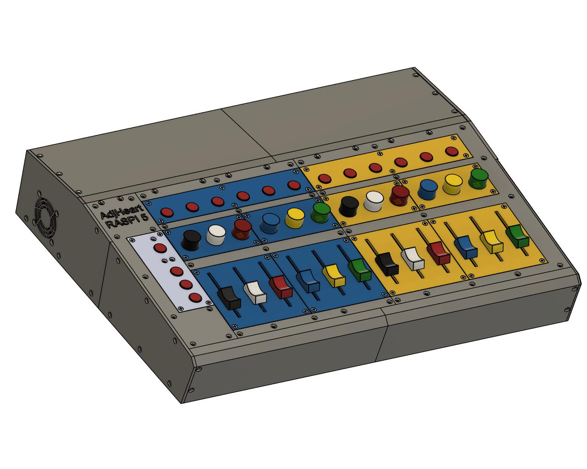

# The AdjHeart Modular Synthesizer

- Note: the project was build using the SysProgs VisualGDB MS Visual Studio plugin https://visualgdb.com/ .

## General Decription
The AdjHert synthesizer is a modular polyphonic MIDI musical synthesizer project.

It is designed, but not limited, to run on a Raspbey Pi 5 computer board.

The project is divided into 2 parts:
1. A c++ engine (this project) that generates, process and controls the audio output played sounds.
2. A Qt5 based application (AdjRasp5SynthApp_1) that provides the workflows and GUI.

The synthesizer supports the JackAudio architecture that provides a low latency audio streaming.

The synthesizer supports external MIDI keyboards and controlers based on the ALSA MIDI streaming architecture

### The AdjSynth Engine
The synthesizer engine integrates 2 major componenets:
1. The open-source FluidSynth soundfonts based polyphonic synthesizer.
2. The proprietary AdjSynth polyphonic synthesizer that provides various digitized "analog" synthesis and processing capbilities. 
This includes an analog adative synthesizer, noise-generator, Karplus string simulator synthesizer, Morphed-sine synthesizer, and
PAD frequency domain synthesizer.

### The AdjSynth GUI

### The AdjSynth Control Box

## Detailed Decription

